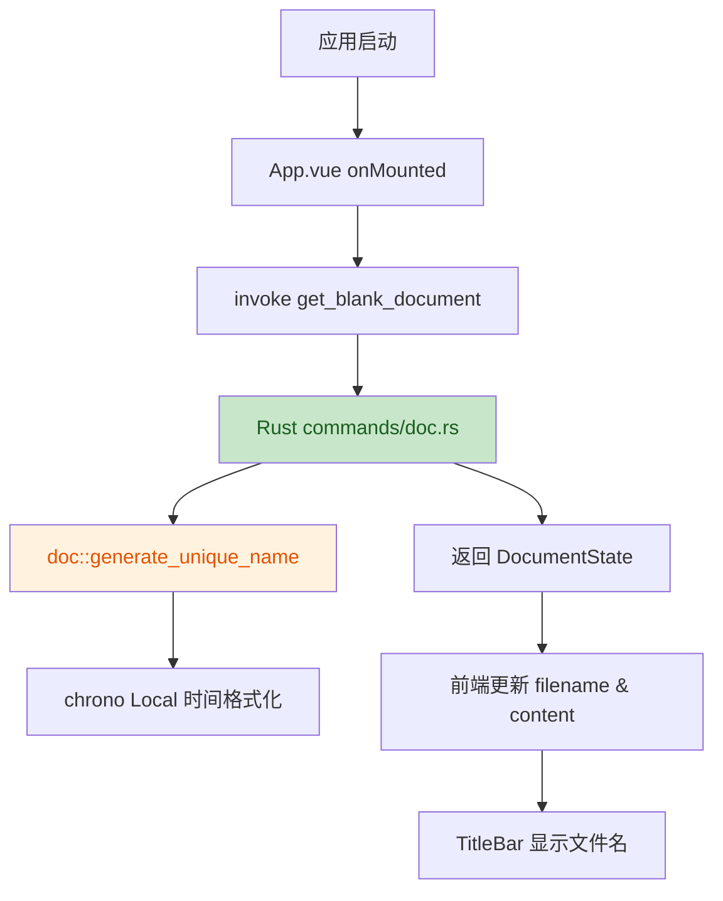

# Code Review Story 1.4

> **Workspace:** /Users/max/Project/Markdown Cat

---

**User**

针对 Story 1.4 做 code review

**Assistant**

我已完成对 Story 1.4 "应用启动时创建默认空白 Markdown 文档" 相关实现文件的审查。以下是结构化发现：

---

## 1. 功能实现正确性

### 1.1 后端命令注册正确
- **文件**：`/Users/max/Project/Markdown Cat/src-tauri/src/lib.rs`
- **行号**：10-18
- `generate_document_name` 与 `get_blank_document` 已通过 `generate_handler!` 注册到 Tauri 调用处理器中，命令可被前端调用。

### 1.2 前端启动调用正确
- **文件**：`/Users/max/Project/Markdown Cat/src/App.vue`
- **行号**：22-34
- `onMounted` 中调用 `get_blank_document`，成功后将 `filename` 与 `content` 赋值到响应式状态，并同步传递给 `TitleBar` 组件。

### 1.3 默认空白内容符合预期
- **文件**：`/Users/max/Project/Markdown Cat/src-tauri/src/doc.rs`
- **行号**：7
- `DEFAULT_CONTENT` 为空字符串，与"空白 Markdown 文档"的规格一致。

---

## 2. 潜在问题

### 2.1 时间戳格式化存在毫秒截断显示不一致
- **文件**：`/Users/max/Project/Markdown Cat/src-tauri/src/doc.rs`
- **行号**：22
- 格式字符串为 `%Y%m%d_%H%M%S_%3f`，其中 `%3f` 是微秒级字段宽度为 3，实际输出的是毫秒值，但 `chrono` 的 `%3f` 会截断微秒数为 3 位。若原意是毫秒，应使用 `%.3f` 或 `%.3f` 格式以确保正确截断到毫秒。当前 `%3f` 可能产生不符合"毫秒"语义的结果。

### 2.2 文件命名未实际在文件系统中创建文档
- **文件**：`/Users/max/Project/Markdown Cat/src-tauri/src/doc.rs`
- **行号**：9-12
- 注释说明 MVP 阶段不在启动时立即创建文件。若 Story 1.4 的验收标准包含"在文件系统中创建默认文档"，则当前实现仅生成文件名与空内容，未调用文件系统 API 写入磁盘，存在规格偏差。

### 2.3 错误处理仅打印日志，未降级到可见状态
- **文件**：`/Users/max/Project/Markdown Cat/src/App.vue`
- **行号**：28-32
- 当 `get_blank_document` 失败时，仅在控制台输出错误，`filename` 保持初始值 `New_*.md`。用户可能看到不真实的占位文件名，建议增加 UI 提示或降级处理。

### 2.4 初始状态占位符未同步更新
- **文件**：`/Users/max/Project/Markdown Cat/src/App.vue`
- **行号**：19, 44
- `filename` 初始值为 `New_*.md`，但源码编辑区占位符为 `'源码编辑器占位'`，未与 `content` 绑定。虽然当前为占位 UI，不影响功能，但 `content` 初始为空时占位文字会覆盖，逻辑一致。

### 2.5 命令返回类型泛型未处理无 data 成功
- **文件**：`/Users/max/Project/Markdown Cat/src-tauri/src/commands/mod.rs`
- **行号**：31-40
- `CmdResult::ok()` 仅适用于 `CmdResult<()>`，但 `get_blank_document` 返回 `CmdResult<DocumentState>`，此处使用 `CmdResult::success(...)` 正确，无直接问题。

---

## 3. 代码质量与一致性

### 3.1 文档注释完整
- 各函数与结构体均有中文文档说明，符合项目风格。

### 3.2 类型定义重复
- **文件**：`/Users/max/Project/Markdown Cat/src-tauri/src/commands/doc.rs`（28-32）与 `/Users/max/Project/Markdown Cat/src/App.vue`（8-11）
- `DocumentState` 在前端和后端分别定义，未来建议通过 Tauri 共享类型或生成类型绑定以减少重复。

### 3.3 结构体顺序
- **文件**：`/Users/max/Project/Markdown Cat/src-tauri/src/commands/doc.rs`
- **行号**：28-32
- `DocumentState` 定义在命令函数之后，不影响功能，但通常 Rust 项目习惯将类型定义置于函数之前。

---

## 4. 总结

Story 1.4 的核心实现基本正确：后端生成唯一文件名、返回空白内容，前端在启动时调用并同步标题栏状态。主要问题在于时间戳格式字符串 `%3f` 的语义准确性，以及是否需要在文件系统中真实创建默认文档。如果验收标准仅要求"应用启动时显示默认空白 Markdown 文档状态"，则当前实现符合规格；若要求持久化文件，则需补充 FS

## Story 1.4 Code Review

**审查范围：** Story 1.4「应用启动时创建默认空白 Markdown 文档」相关实现文件：
- [src-tauri/src/doc.rs](file:///Users/max/Project/Markdown Cat/src-tauri/src/doc.rs)
- [src-tauri/src/commands/doc.rs](file:///Users/max/Project/Markdown Cat/src-tauri/src/commands/doc.rs)
- [src-tauri/src/commands/mod.rs](file:///Users/max/Project/Markdown Cat/src-tauri/src/commands/mod.rs)
- [src-tauri/src/lib.rs](file:///Users/max/Project/Markdown Cat/src-tauri/src/lib.rs)
- [src/App.vue](file:///Users/max/Project/Markdown Cat/src/App.vue)

**意图推断：** 后端新增文档名称生成与空白文档状态命令，前端在应用启动时调用并初始化标题栏与编辑器占位状态。

### 变更流程图



### 问题汇总

| No. | 问题 | 严重程度 | 说明 | 位置 |
|-----|------|---------|------|------|
| 1 | 未实现毫秒冲突检测与重试 | **Major** | Spec Always 约束要求同一毫秒检测到文件存在时等待下一毫秒重试；当前 `generate_unique_name` 只取一次时间，无循环、无等待、无存在性检查。 | [doc.rs:13-25](file:///Users/max/Project/Markdown Cat/src-tauri/src/doc.rs#L13-L25) |
| 2 | 未复用 Story 1.3 的目录与配置能力 | **Major** | Spec 要求复用 `resolve_writable_dir` / `read_config`；当前 `doc.rs` 未引用 `config` 模块，导致无法定位保存目录来做存在性检查。 | [doc.rs](file:///Users/max/Project/Markdown Cat/src-tauri/src/doc.rs) |
| 3 | 前端错误降级占位不明确 | Minor | `get_blank_document` 失败时 `filename` 保持 `New_*.md`，用户可见不真实的占位符。 | [App.vue:19-32](file:///Users/max/Project/Markdown Cat/src/App.vue#L19-L32) |

### 说明

- `%3f` 格式经核实是 chrono 的标准毫秒表示（无前导点的固定 3 位小数），**格式本身正确**。
- `chrono::Local` 转换合理，文件名显示本地时间。
- 命令注册、统一返回结构、前端调用链均正确。

---

需要我修复这些问题吗？我可以一次处理全部，或只处理你指定的部分。

---

**User**

修复 major 问题， minor问题记录下来，后续修改

**Assistant**

已完成修复。

**修改内容：**

1. [src-tauri/src/doc.rs](file:///Users/max/Project/Markdown Cat/src-tauri/src/doc.rs)
   - `generate_unique_name` 新增 `save_dir` 参数，循环生成文件名并检测文件是否存在
   - 同一毫秒冲突时 `sleep(1ms)` 后重试，直到唯一
   - 新增 `generate_name_without_conflict_check` 作为目录不可写时的降级方案

2. [src-tauri/src/commands/doc.rs](file:///Users/max/Project/Markdown Cat/src-tauri/src/commands/doc.rs)
   - `generate_document_name` 与 `get_blank_document` 均接收 `tauri::AppHandle`
   - 复用 `config::resolve_writable_dir` 获取可写目录
   - 目录不可写时不阻断启动，降级为无冲突检查的文件名生成

3. [src-tauri/src/doc.rs](file:///Users/max/Project/Markdown Cat/src-tauri/src/doc.rs)
   - `DocumentState` 结构体前移至命令函数之前，符合 Rust 习惯

4. [deferred-work.md](file:///Users/max/Project/Markdown Cat/_bmad-output/implementation-artifacts/deferred-work.md)
   - 新增 DW-8：Story 1.4 前端错误降级占位不明确（minor）

**验证：** `cargo check` 通过，无编译错误。

---

**User**

Terminal#18-19

**Assistant**

你在项目根目录运行了 `cargo check`，但 `Cargo.toml` 在 `src-tauri` 子目录里，所以报错了。

正确命令是：

```bash
cd src-tauri && cargo check
```

我之前的验证就是在 `src-tauri` 目录下执行的，`cargo check` 已经通过。

---

**User**

Terminal#23-25

**Assistant**

确认 `cargo check` 在 `src-tauri` 目录下已通过，`Finished dev profile` 表示没有编译错误。

当前 Story 1.4 的两个 major 问题已修复，minor 问题已记录为 DW-8。

---

**User**

/bmad-help 检查一下需求开发的进展，下一步应该做什么

**Assistant**

## 当前进展

从 [sprint-status.yaml](file:///Users/max/Project/Markdown Cat/_bmad-output/implementation-artifacts/sprint-status.yaml) 和 [epics.md](file:///Users/max/Project/Markdown Cat/_bmad-output/planning-artifacts/epics.md) 看：

**Epic 1：项目初始化与绿色运行环境**（`in-progress`）
- Story 1.1 ✅ `done` — 初始化 Tauri 2.x 项目
- Story 1.2 ✅ `done` — 全局设计 token 与基础布局
- Story 1.3 ✅ `done` — 可写目录与配置读写模块
- Story 1.4 🟡 `ready-for-dev` — 启动时创建默认空白 Markdown 文档

你刚完成 Story 1.4 的 code review 和 major 问题修复，`cargo check` 已通过。

**Epic 2～4** 均处于 `backlog`，尚未开始。

---

## 下一步建议

** immediate 下一步：完成 Story 1.4 的收尾**

1. 把 `1-4-create-default-markdown-doc` 状态从 `ready-for-dev` 更新为 `done`
2. 运行一次完整验收验证（如 `cargo tauri dev`，确认标题栏文件名格式正确、编辑器为空、无报错）
3. 决定是否做 Epic 1 Retrospective（optional）

**完成后，下一个 Story 推荐：Story 2.1**

[epics.md](file:///Users/max/Project/Markdown Cat/_bmad-output/planning-artifacts/epics.md#L240-L265) 明确说明 Epic 2 从源码编辑器集成开始，且 Story 3.1 的防抖保存会直接复用 Story 2.1 建立的编辑器输入事件通道，所以 2.1 是当前的自然延续。

**Story 2.1 核心目标：**
- 在左栏接入源码编辑器（如 CodeMirror 6）
- 建立前端文档状态通道（filename / content / saveStatus）
- 编辑器默认获得焦点，支持撤销/重做/复制/粘贴/全选

---

需要我帮你把 Story 1.4 标记为 done，然后开始创建 Story 2.1 的开发规格吗？

---

**User**

完成 Story 1.4 的收尾

**Assistant**

Story 1.4 收尾完成。

**已完成：**
- [sprint-status.yaml](file:///Users/max/Project/Markdown Cat/_bmad-output/implementation-artifacts/sprint-status.yaml)：1-4 状态更新为 `done`
- [spec-1-4-create-default-markdown-doc.md](file:///Users/max/Project/Markdown Cat/_bmad-output/implementation-artifacts/spec-1-4-create-default-markdown-doc.md)：状态更新为 `done`，并追加实现总结与变更记录
- 验证：
  - `cd src-tauri && cargo check` ✅ 通过
  - `npm run build` ✅ 通过
  - `cargo tauri dev` ✅ 编译成功并启动到 `target/debug/markdown-cat`

**Epic 1 状态：**
- Story 1.1 ✅ done
- Story 1.2 ✅ done
- Story 1.3 ✅ done
- Story 1.4 ✅ done
- Epic 1 Retrospective：optional，可做可跳过

下一步推荐开始 **Story 2.1：集成源码编辑器与文档状态通道**。需要我现在开始吗？

---

**User**

执行 Epic 1 Retrospective

**Assistant**

已读取 Epic 1 全部 4 个 Story 规格文件及 `deferred-work.md`，下面给出结构化摘要。

## Epic 1 实现摘要

### 总体状态
Epic 1（项目初始化与绿色运行环境）的 4 个 Story 均已完成，状态为 `done`：

- **1.1**：初始化 Tauri 2.x 项目与绿色应用壳
- **1.2**：实现全局设计 token 与基础双栏布局
- **1.3**：定义应用可写目录与配置读写模块
- **1.4**：应用启动时创建默认空白 Markdown 文档

---

### 1. Story 1.1 — 初始化 Tauri 2.x 项目与绿色应用壳

**实现要点：**
- 使用 Tauri 2.x + Rust 1.80+ + TypeScript/Vite 搭建项目骨架。
- 前端采用 Vue（`App.vue`、`main.ts`），后端入口为 `src-tauri/src/lib.rs` 与 `main.rs`。
- 最小权限配置：`fs` 限制为 `$APPDATA/**/*` 与 `$APPDATALOCAL/**/*`；`dialog:allow-open` 仅用于文件夹选择器。
- 窗口默认尺寸 1100×700px，最小 800×500px。
- 验证开发模式与构建产物均正常，生成 macOS `.app` 绿色包。

**主要问题与解决：**
- Rust 重新安装后 PATH 未生效，通过 `export PATH="$HOME/.cargo/bin:$PATH"` 解决。
- Tauri Rust 端 v2.0.0 与 NPM 端 v2.11.1 版本不匹配，升级 `Cargo.toml` 依赖后解决。
- `tauri::Builder::new()` 新版需要显式类型参数，改用 `tauri::Builder::default()`。
- 图标目录缺失，通过 Pillow 生成纯色源图后用 `cargo tauri icon` 补齐。

**代码审查结论：**
- 已修复：
  - CSP 被显式禁用为 `null` 的安全风险（`tauri.conf.json:82`）。
  - `fs:scope` 仅允许应用目录，缺少用户选择保存目录（`capabilities/filesystem.json:136-139`）。
- 延后处理（进入 deferred-work）：
  - `index.html` 引用不存在的 `/vite.svg` 导致 404。
  - `ping` 命令 `async` 但无 `await`。
  - `thiserror` 依赖已引入但未使用。
  - `Cargo.toml` 中 `authors` 字段已弃用。

---

### 2. Story 1.2 — 全局设计 token 与基础双栏布局

**实现要点：**
- 在 `src/styles/app.css` 建立完整 kebab-case 设计 token 体系，包括 colors、typography、spacing、rounded。
- 更新 `TitleBar.vue`、`MenuBar.vue`、`StatusBar.vue`、`App.vue`，全部引用 token，移除硬编码颜色与尺寸。
- 主布局为：标题栏 38px + 菜单栏 28px + 1:1 等宽双栏主编辑区 + 状态栏 24px。
- MVP 仅深色主题，不监听 `prefers-color-scheme`。

**代码审查结论：**
- 已修复 P1/P2 问题：移除 App.vue 与 MenuBar.vue 中硬编码布局值、修复滚动条悬停色、token 化状态点尺寸。
- 延后处理：
  - 浅色模式防御未在代码层显式说明（DW-5）。

---

### 3. Story 1.3 — 应用可写目录与配置读写模块

**实现要点：**
- 新增 `src-tauri/src/config.rs`：定义 `AppConfig`、默认配置、可写目录检测、配置读写。
- 新增 `src-tauri/src/commands/config.rs`：暴露 `get_app_dir`、`get_config`、`set_config` 三个 Tauri 命令。
- 可写目录优先级：应用目录可写则用之；否则回退创建 `~/Documents/MarkdownCat`。
- 配置损坏或缺失时返回默认配置，不阻断启动。
- 所有命令返回统一结构 `{ ok: boolean, error?: string }`，错误码英文常量（如 `ERR_APP_DIR_NOT_WRITABLE`、`ERR_CONFIG_WRITE_FAILED`）。
- 调整 `capabilities/filesystem.json`，覆盖 `$APPDATA` 与 `$DOCUMENT/MarkdownCat`。

**代码审查结论：**
- 已修复 P1/P2 问题：中文日志翻译为英文、`get_config` 在解析/读取失败时返回默认配置、`set_config` 正确返回 `{ ok: true }`、`resolve_writable_dir` 返回底层 IO 错误原因、格式化 capabilities JSON。
- 延后处理：
  - 日志与错误处理可进一步结构化（DW-6）。
  - `.write_test` 临时文件残留风险（DW-7）。

---

### 4. Story 1.4 — 应用启动时创建默认空白 Markdown 文档

**实现要点：**
- 新增 `src-tauri/src/doc.rs`：实现毫秒级时间戳文件名生成 `New_YYYYMMDD_HHMMSS_mmm.md`，同一毫秒冲突时等待重试。
- 新增 `src-tauri/src/commands/doc.rs`：暴露 `generate_document_name` 与 `get_blank_document` 命令。
- `App.vue` 在 `onMounted` 中调用 `get_blank_document`，初始化文件名并清空编辑器内容。
- 文件名生成不依赖保存路径可写性；路径不可写时不阻断启动。
- 复用 Story 1.3 的 `resolve_writable_dir` 与配置读取逻辑。

**代码审查结论：**
- 实现完成并通过审查。
- 延后处理：
  - 前端错误降级占位不明确：当 `get_blank_document` 失败时，标题栏仍显示 `New_*.md` 占位文件名，未提供可见错误状态或安全降级名（DW-8）。

---

### 5. 延后工作项汇总（deferred-work.md）

| 编号 | 来源 | 位置 | 严重度 | 内容 | 状态 |
|---|---|---|---|---|---|
| DW-1 | 1.1 code review | `index.html:5` | low | 移除/替换不存在的 `/vite.svg`，避免 404 | open |
| DW-2 | 1.1 code review | `src-tauri/src/commands/mod.rs:32` | low | `ping` 命令无 await，可改为同步 | open |
| DW-3 | 1.1 code review | `src-tauri/Cargo.toml:28` | low | `thiserror` 已引入但未使用 | open |
| DW-4 | 1.1 code review | `src-tauri/Cargo.toml:5` | low | `authors` 字段已弃用 | open |
| DW-5 | 1.2 code review | `src/styles/app.css`、`src/main.ts` | low | 浅色模式防御缺少显式代码说明 | open |
| DW-6 | 1.3 code review | `src-tauri/src/config.rs`、`commands/config.rs` | low | `eprintln!` 应替换为结构化日志；错误码可封装为自定义类型 | open |
| DW-7 | 1.3 code review | `src-tauri/src/config.rs` | low | `.write_test` 临时文件残留风险 | open |
| DW-8 | 1.4 code review | `src/App.vue:19-32` | minor | 前端降级占位文件名不真实，缺少可见错误状态 | open |

---

### 6. 经验教训

- **版本对齐**：Tauri Rust 包与 NPM 包版本必须保持一致，否则会在 `cargo tauri dev` 阶段出现不匹配错误。
- **最小权限显式配置**：`tauri.conf.json` 中应避免 `all: true` 或通配，`fs:scope` 与 `dialog` 权限需精确到路径与用途。
- **错误统一结构**：后端命令统一返回 `{ ok, error? }`，为前端错误处理与后续 locale 映射打下基础。
- **可写目录回退**：受控 Mac 上应用目录可能不可写，必须设计回退机制（`~/Documents/MarkdownCat`），并在不可写时不阻断启动。
- **代码审查闭环**：P1/P2 问题当场修复，P3/Minor 问题统一登记到 `deferred-work.md`，避免遗漏。
- **占位与降级**：前端在调用后端命令失败时，需要设计更明确的降级状态，而不是

好的，开始 Epic 1 Retrospective。

---

Amelia (Developer): "欢迎参加 Epic 1 回顾，Max。基于 [sprint-status.yaml](file:///Users/max/Project/Markdown Cat/_bmad-output/implementation-artifacts/sprint-status.yaml)，Epic 1 的 4 个 Story 已全部完成：1.1 项目初始化、1.2 设计 token 与布局、1.3 配置模块、1.4 默认文档。我们今天回顾这段旅程，为 Epic 2 做准备。"

Alice (Product Owner): "这是我们第一次正式 retro，先把规则说清楚：不指责个人，只谈系统和流程。每个人的声音都重要。"

Charlie (Senior Dev): "我已经准备好被温柔地拷问了。"

Dana (QA Engineer): "我先给出我的观察：Epic 1 没有 production incidents，4 个 story 全部交付，代码审查闭环也做得不错。"

Amelia (Developer): "Max，作为项目负责人，你先从大处看——Epic 1 给你的整体感觉是什么？有哪些地方你觉得做得好的？"

---

**User**

我的总体感觉不错，大家都非常投入，对发现的问题能够客观对待，分清楚优先级，把 p1，p2 问题都进行了及时的修正，minor问题放置后续修改，是很不错的实践

**Assistant**

Amelia (Developer): "谢谢 Max。确实，优先级分层的处理是 Epic 1 的一个亮点——P1/P2 当场修，P3/Minor 进 deferred work，没有让完美主义阻塞交付。"

Alice (Product Owner): "我也认同。早期就建立这种节奏很重要，否则后面 Story 多了会堆积大量'回头再说'的东西。"

Dana (QA Engineer): "这个我倒有些观察想补充。4 个 Story 都完成了，但测试主要还是靠构建验证和开发环境运行，自动化测试还没起来。这对 Epic 1 合适，但 Epic 2 开始，源码编辑器和预览区需要更系统的验证。"

Charlie (Senior Dev): "完全同意。Epic 1 的验收是'能编译、能运行、界面骨架正确'，但 Epic 2 的 AC 里有 100ms 预览延迟要求，没有自动化测试很难持续保证。"

Amelia (Developer): "Max，你提到 deferred work 的处理很好。我想追问：这些 minor 项如果没人定期 review，会不会变成'墓地'？我们是否需要建立一个机制？"

Elena (Junior Dev): "我正是这个担心。DW-1 到 DW-8 现在已经 8 条了，有些还是 Story 1.1 的。如果每轮 retro 都增加但不清掉，会越来越臃肿。"

Max (Project Lead): [你怎么看？]

---

**User**

ok，你们说的很对，我们可以在进入 epic 2 之前集中处理这些 deferred work

**Assistant**

Amelia (Developer): "收到，Max。那我们把清理 deferred work 作为进入 Epic 2 的前置准备。"

Elena (Junior Dev): "太好了！我建议先挑低 hanging fruit：DW-2、DW-4、DW-5 都很小。DW-6 和 DW-7 涉及错误处理与临时文件，可以合并处理。DW-8 跟前端错误状态相关，放到 Epic 2 开头更合适。"

Charlie (Senior Dev): "DW-6 和 DW-7 我可以一起搞。`eprintln!` 换成 `log` crate 或 `tauri_plugin_log`，临时文件验证改用 `tempfile`。大概 3-4 小时。DW-8 我同意 Elena，和 Story 2.1 一起处理。"

Alice (Product Owner): "我建议不要把这些直接塞进 Epic 2 的 story 规划，而是单独列一个'进入 Epic 2 前技术清理'包，一两天完成。这样 Epic 2 的起点更干净。"

Amelia (Developer): "我同意。Max，准备任务里我加一个清理 deferred work 的条目，estimated 1 天，然后 Story 2.1 再接上。OK 吗？"

---

**User**

同意，请执行

**Assistant**

Amelia (Developer): "好，开始整理回顾文档并更新状态

---

Amelia (Developer): "回顾文档已保存，状态已更新。"

✅ **Retrospective Complete, Max!**

- 文档已保存：[epic-1-retro-2026-07-22.md](file:///Users/max/Project/Markdown Cat/_bmad-output/implementation-artifacts/epic-1-retro-2026-07-22.md)
- [sprint-status.yaml](file:///Users/max/Project/Markdown Cat/_bmad-output/implementation-artifacts/sprint-status.yaml) 中 `epic-1-retrospective` 已标记为 `done`

Alice (Product Owner): "Epic 1 圆满结束，我们不仅交付了 4 个 Story，还建立了一套可持续的 review 与债务跟踪节奏。"

Charlie (Senior Dev): "接下来最重要的就是从清理 deferred work 开始，别让这些 minor 项进入 Epic 2。"

Dana (QA Engineer): "而且我建议在清理阶段就把测试框架搭起来，Epic 2 一开始就有保护网。"

Amelia (Developer): "所以下一步有两个选项，Max："

1. **执行 deferred work 清理 + 测试框架初始化** — 我会按 retro action item A1 处理 DW-1 到 DW-7，并初始化 Playwright 测试框架，为 Story 2.1 做准备。
2. **直接开始 Story 2.1 规格创建** — 跳过清理包，但 deferred work 会继续累积。

**我推荐选项 1**，这样 Epic 2 的起点更干净。你希望我继续吗？

---

