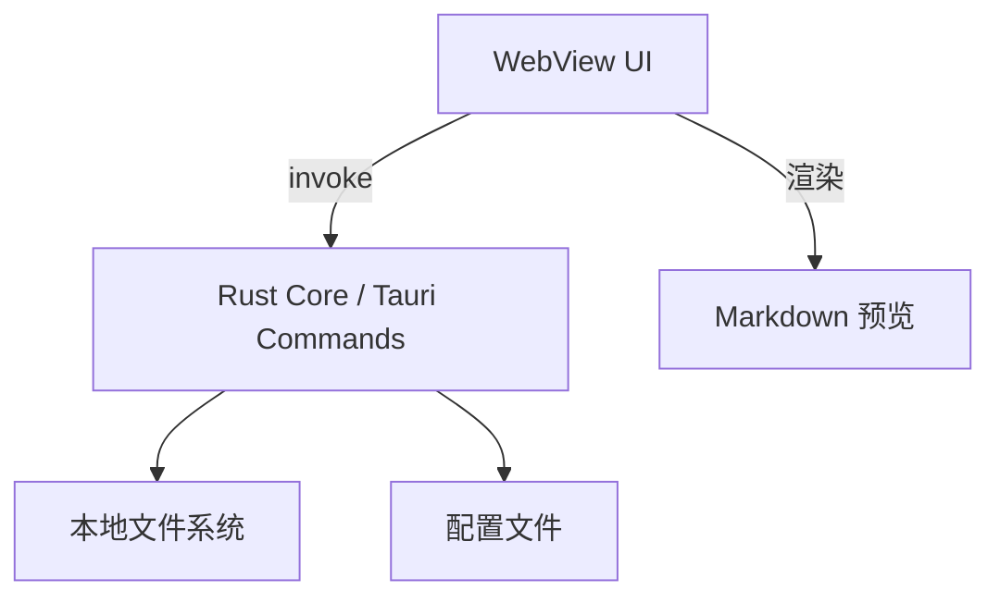

# Architecture Spine — 便携绿色 Markdown 编辑器

## Design Paradigm

**分层桌面应用：Tauri + Web 前端**

- **前端（WebView）**：负责 UI 渲染、Markdown 编辑与预览、用户状态；通过 Tauri `invoke` 调用后端能力。
- **后端（Rust）**：负责文件系统、系统对话框、配置持久化、剪贴板图片处理；不持有业务状态，只执行命令。
- **数据层**：普通 `.md` 文件 + `assets/` 目录 + 本地 JSON 配置文件，无数据库、无云服务。



## Invariants & Rules

### AD-1 — Tauri 2.x 作为应用壳 [ADOPTED]

- **Binds:** 整个应用
- **Prevents:** 选择 Electron 导致包体积过大、或选择原生 SwiftUI 导致 Windows 重写
- **Rule:** 应用必须基于 Tauri 2.x 构建；前端用任意 Web 框架编译为静态资源；后端命令用 Rust 实现；`tauri.conf.json` 必须启用 `fs` 和 `dialog` 权限，且仅申请最小权限集。

### AD-2 — 文件系统作为唯一数据源

- **Binds:** 文档、图片、配置
- **Prevents:** 引入数据库、云同步或私有文件格式导致数据锁定
- **Rule:** 每篇笔记是一个独立的 `.md` 文件；图片保存为与 `.md` 同目录的 `assets/` 下的相对路径；配置以 JSON 形式保存在应用可写目录；所有文件操作都通过 Tauri 的 `fs` API 执行，禁止前端直接写盘。

### AD-3 — 双栏编辑模型

- **Binds:** 编辑器 UI、预览渲染
- **Prevents:** 左栏或预览栏独立演进导致数据不一致
- **Rule:** 左栏为源码编辑器，右栏为只读预览；两者共享同一份字符串状态；用户输入时同步更新该状态，预览被动响应状态变化；禁止预览区直接修改内容。

### AD-4 — 按键级自动保存

- **Binds:** 编辑器状态、文件系统、错误处理
- **Prevents:** 保存时机不一致导致数据丢失或并发写冲突
- **Rule:** 编辑器状态变化后触发防抖保存（默认 300ms）；保存失败时必须在 UI 中提示用户，且保留当前编辑状态；保存操作必须在 Rust 后端执行，返回成功/失败状态。

### AD-5 — 绿色便携优先

- **Binds:** 打包、部署、配置存储
- **Prevents:** 依赖安装程序、写入系统目录或注册表
- **Rule:** 应用以单个 `.app`（macOS）或 `.exe`（Windows）形式分发，无需安装；运行时配置与业务数据写入应用可写目录（或应用包内可写区）；Tauri 框架日志可写入 `~/Library/Application Support/com.markdowncat.dev`；不修改系统注册表、不依赖管理员权限。

## Consistency Conventions

| Concern | Convention |
| --- | --- |
| 命名（文件、函数、事件） | 文件命名：`New_YYYYMMDD_HHMMSS.md`；Rust 命令使用 camelCase 在 JS 侧；目录按 `src/` 前端、`src-tauri/src/` 后端区分。 |
| 数据格式 | Markdown 源码使用 UTF-8；配置文件 JSON；图片路径使用相对路径 `assets/<filename>`；日期格式 `YYYY-MM-DD HH:MM:SS`。 |
| 状态与跨切面 | 前端单一状态树保存当前文档内容；后端无状态，每次 `invoke` 独立执行；错误统一返回 `{ ok: boolean, error?: string }`；所有文件操作必须处理失败。 |

## Stack

| Name | Version / Role |
| --- | --- |
| Tauri | 2.x — 桌面应用壳与 IPC |
| Rust | 1.80+ — 后端命令与系统 API |
| TypeScript / Vite | 前端构建与 UI 框架（推荐 Vue 3 或 React 18） |
| CodeMirror 6 | 左栏 Markdown 源码编辑器 |
| markdown-it / marked | 右栏 Markdown 渲染（推荐 marked，体积更小） |
| Tauri fs / dialog plugins | 文件系统访问与系统对话框 |

## Structural Seed

```text
markdown-cat/
├── src/                      # 前端
│   ├── main.tsx              # 应用入口
│   ├── App.tsx               # 双栏布局容器
│   ├── components/
│   │   ├── Editor.tsx        # CodeMirror 源码编辑器
│   │   ├── Preview.tsx       # Markdown 预览
│   │   └── Toolbar.tsx       # 文件/设置菜单
│   ├── stores/
│   │   └── document.ts       # 文档状态（源码、文件名、保存状态）
│   ├── lib/
│   │   ├── tauri.ts          # invoke 封装
│   │   └── markdown.ts       # 渲染与图片路径处理
│   └── styles/
│       └── app.css
├── src-tauri/
│   ├── src/
│   │   ├── main.rs           # 入口
│   │   ├── lib.rs            # 命令模块注册
│   │   ├── commands/
│   │   │   ├── file.rs       # 保存、读取、重命名
│   │   │   ├── config.rs     # 配置读写
│   │   │   └── image.rs      # 图片粘贴处理（Should）
│   │   └── config.rs         # 配置数据结构
│   ├── Cargo.toml
│   └── tauri.conf.json
└── assets/                   # 静态资源
```

## Capability → Architecture Map

| Capability / Area | Lives in | Governed by |
| --- | --- | --- |
| 启动打开空白文档 | `App.tsx` + `document.ts` | AD-3, AD-4 |
| 双栏编辑/预览 | `Editor.tsx`, `Preview.tsx` | AD-3 |
| 实时 Markdown 渲染 | `Preview.tsx` + `markdown.ts` | AD-3 |
| 标题栏保存状态 | `App.tsx` + `document.ts` | AD-3, AD-4 |
| 空状态与响应式布局 | `App.tsx` + `Preview.tsx` | AD-3 |
| 窗口缩放与 DPI 适配 | `App.tsx` | AD-5 |
| 按键级自动保存 | `document.ts` + `file.rs` | AD-4 |
| 设置文件存储路径 | `Toolbar.tsx` + `config.rs` | AD-2, AD-5 |
| 图片粘贴（Should） | `image.rs` + `Editor.tsx` | AD-2 |
| 绿色便携运行 | `src-tauri/` 打包配置 | AD-1, AD-5 |

## Deferred

- **具体前端框架选择**：Vue 3 或 React 18 在项目初始化时确定；不影响核心架构不变量。
- **Markdown 渲染库**：marked 或 markdown-it，在实现阶段根据性能与扩展性需求最终确定。
- **图片粘贴实现细节**：作为 MVP 后的增强项，具体剪贴板读取格式和压缩策略在史诗阶段确定。
- **Windows 第二版打包策略**：在 MVP 完成后再评估签名、安装器策略与 WebView2 兼容性。

## Open Questions

- 是否需要“最近打开的文件”列表？
- 是否需要在应用包内包含完整的运行时，还是允许依赖系统已安装的 WebView？（Tauri 2.x 默认使用系统 WebView）
- 未签名应用在 macOS 上的 Gatekeeper 绕过/说明方案。
